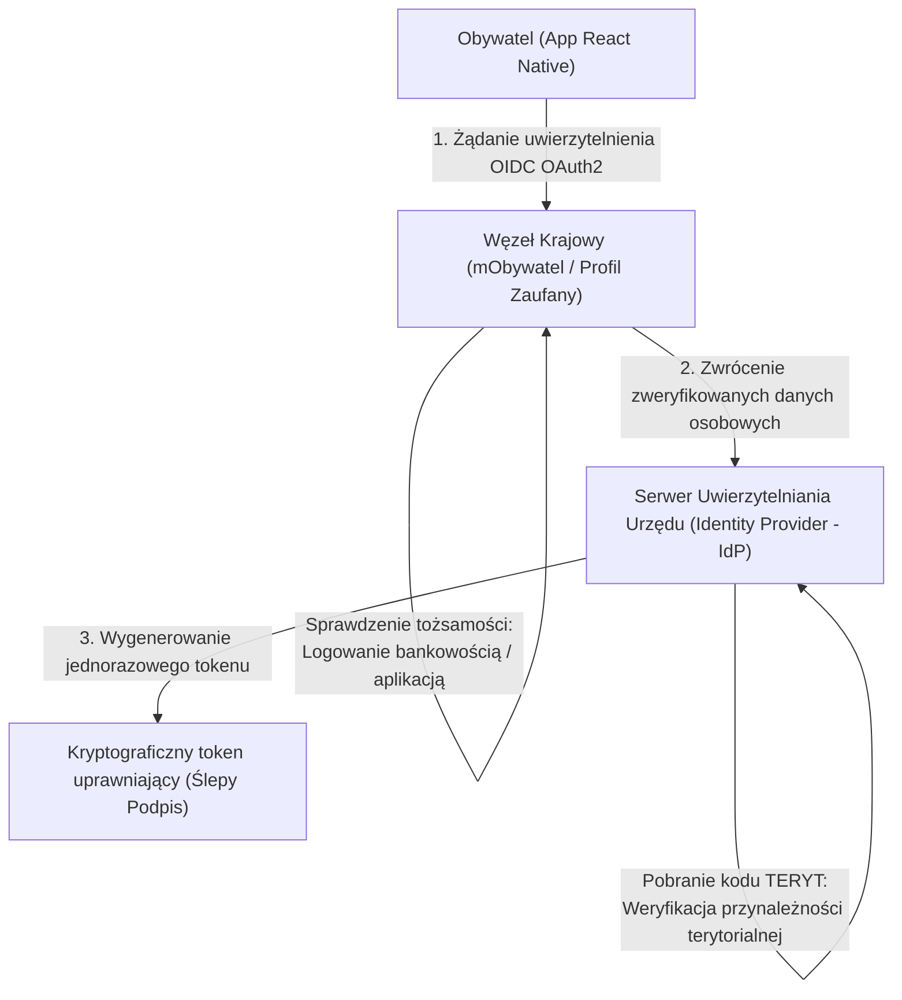
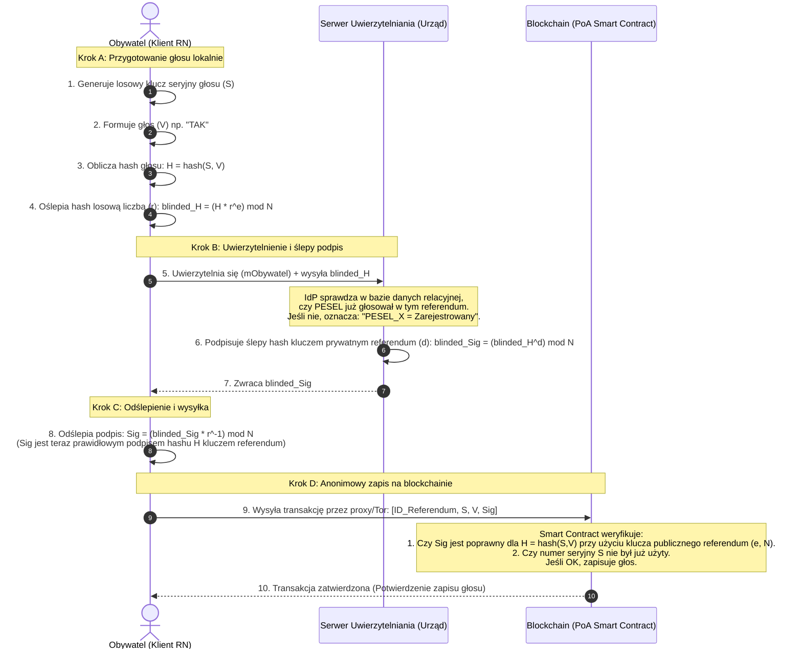
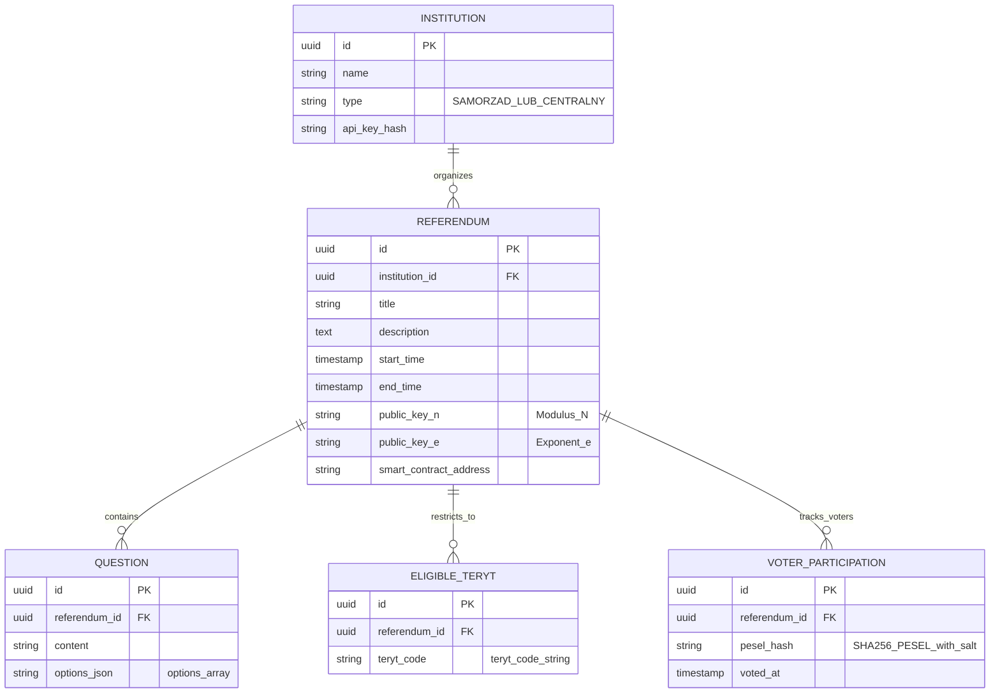

# Dokumentacja projektowa: mGłosObywatela (Dokumentacja MVP)
**Zdecentralizowana platforma mikro-referendów lokalnych i ogólnokrajowych w Polsce**

## 1. Opis pomysłu i cel aplikacji (Zgodnie z zad1.md)

### 1.1. Intro
* **Nazwa projektu:** mGłosObywatela
* **Typ aplikacji:** Hybrydowa aplikacja mobilna (React Native + Expo) dla Obywateli oraz panel administracyjny Web (React/Next.js) dla urzędów centralnych i samorządowych.
* **Krótki opis:** Platforma umożliwiająca przeprowadzanie w pełni bezpiecznych, anonimowych i niezmiennych mikro-referendów na szczeblu gminnym, powiatowym oraz ogólnokrajowym, zintegrowana z państwowymi systemami tożsamości (mObywatel).

### 1.2. Problem i cel aplikacji
Współczesne referenda lokalne w Polsce (np. w sprawach odwołania wójta/rady, inwestycji gminnych) obarczone są ogromnymi kosztami logistycznymi, niską frekwencją (często uniemożliwiającą osiągnięcie wymaganego progu 30%) oraz brakiem zaufania do tradycyjnych, papierowych procedur liczenia głosów. Z kolei istniejące systemy e-konsultacji (np. budżety obywatelskie) nie gwarantują tajności głosowania – administratorzy baz danych mogą łatwo powiązać tożsamość użytkownika z jego wyborem.

**Główne cele użytkowe:**
* **Konstytucyjna tajność i niezmienność:** Zapewnienie, że nikt (w tym administrator systemu) nie powiąże tożsamości obywatela z jego głosem, przy jednoczesnym kryptograficznym zagwarantowaniu, że oddany głos nie zostanie zmodyfikowany ani usunięty.
* **Obniżenie kosztów i powszechność:** Zredukowanie kosztu przeprowadzenia referendum o ponad 95% i umożliwienie oddania głosu w kilka sekund z poziomu smartfona.
* **Geofencing prawno-administracyjny:** Automatyczne filtrowanie referendów na podstawie kodu terytorialnego TERYT przypisanego do PESEL-u obywatela.

### 1.3. Odbiorcy i scenariusze użycia (Persony)
* **Persona 1: Janusz (54 lata), rolnik/przedsiębiorca z gminy wiejskiej.**
  * *Potrzeba:* Chce wyrazić sprzeciw wobec planowanej budowy fermy przemysłowej w sąsiedztwie.
  * *Frustracja:* Nie ma czasu jechać do urzędu gminy w godzinach pracy, obawia się też, że jego głos "zaginie" lub wójt dowie się, jak głosował (konflikt interesów).
  * *Kontekst użycia:* Loguje się przez profil zaufany mObywatel, system automatycznie przypisuje go do referendum jego gminy, oddaje głos anonimowo z telefonu.
* **Persona 2: Anna (28 lat), menedżerka z Warszawy.**
  * *Potrzeba:* Chce współdecydować o kierunku rozwoju lokalnej infrastruktury rowerowej na Mokotowie.
  * *Frustracja:* Tradycyjne konsultacje są ogłaszane w mało widocznych miejscach (BIP).
  * *Kontekst użycia:* Otrzymuje powiadomienie o nowym referendum konsultacyjnym dla mieszkańców Mokotowa (filtr TERYT), głosuje w drodze do pracy.

### 1.4. Analiza porównawcza
| Kryterium | Tradycyjne referendum papierowe | Systemy e-konsultacji (Budżet Obywatelski) | mGłosObywatela |
| :--- | :--- | :--- | :--- |
| **Koszt wdrożenia** | Bardzo wysoki (druk kart, komisje) | Średni (dedykowane portale) | Niski (zdecentralizowana sieć) |
| **Tajność głosowania** | Wysoka (fizyczna urna) | Niska (powiązanie w relacyjnej bazie) | **Kryptograficznie absolutna** (ZKP/Blind Signatures) |
| **Weryfikacja tożsamości** | Dowód osobisty w komisji | Często deklaratywna (podatna na boty) | **Profil Zaufany / mObywatel API** |
| **Odporność na fałszerstwa** | Podatność na błędy ludzkie | Podatność na modyfikację bazy przez admina | **Niezmienność ledgeru blockchain** |

---

## 2. Analiza prawna i integracja tożsamości

### 2.1. Powiązanie z polskim porządkiem prawnym
Projekt mGłosObywatela projektowany jest z myślą o pełnej zgodności z:
1. **Konstytucją RP (Art. 4 i Art. 62):** Władza zwierzchnia należy do Narodu, który wykonuje ją m.in. przez referendum. Wymóg zachowania zasad powszechności, bezpośredniości i tajności jest kluczowym założeniem kryptograficznym systemu.
2. **Ustawą o referendum lokalnym (Dz.U. 2000 nr 62 poz. 718):** Ustawa definiuje progi frekwencyjne (referendum jest ważne, jeżeli wzięło w nim udział co najmniej 30% uprawnionych do głosowania). System automatycznie zlicza frekwencję na podstawie liczby wydanych kryptograficznych tokenów autoryzacyjnych.
3. **Ustawą o informatyzacji działalności podmiotów realizujących zadania publiczne:** Umożliwia wykorzystanie Węzła Krajowego (WK) jako oficjalnego środka identyfikacji elektronicznej.

### 2.2. Mechanizm weryfikacji uprawnień
Aby uniemożliwić głosowanie osobom nieuprawnionym oraz zapobiec atakiem Sybil (tworzenie fałszywych kont), system integruje się z **Węzłem Krajowym (eIDAS / Profil Zaufany / mObywatel API)**:



* **PESEL:** Służy do potwierdzenia tożsamości oraz sprawdzenia, czy obywatel ukończył 18 rok życia w dniu głosowania.
* **TERYT (Krajowy Rejestr Urzędowego Podziału Terytorialnego Kraju):** Pobierany z rejestru PESEL (kod gminy/powiatu zameldowania lub zdeklarowanego zamieszkania). Na podstawie kodu TERYT system filtruje listę referendów, do których obywatel ma prawo przystąpić.

---

## 3. Architektura kryptograficzna i blockchain

### 3.1. Rozdzielenie tożsamości od głosu (RSA Blind Signatures)
Największym wyzwaniem systemów e-voting jest sprzeczność: **musimy wiedzieć, kto głosował** (aby zapobiec podwójnemu głosowaniu), ale **nie możemy wiedzieć, jak głosował**.

W projekcie mGłosObywatela stosujemy **ślepe podpisy RSA (Chaum's Blind Signatures)**:



> [!NOTE]
> Dzięki temu rozwiązaniu:
> * Serwer urzędu (IdP) widzi tożsamość obywatela i `blinded_H`, ale ze względu na czynnik oślepiający `r` nie wie, jaki jest prawdziwy hash głosu ani sam głos `V`.
> * Blockchain widzi czysty hash `H`, głos `V`, numer seryjny `S` i poprawny podpis urzędu `Sig`. Ponieważ nikt poza klientem nie zna wartości `r`, nie da się powiązać danych z blockchaina z logami serwera uwierzytelniającego.

### 3.2. Konsorcjalny blockchain (Proof of Authority)
Zamiast publicznego blockchaina (np. Ethereum, gdzie opłaty za transakcje gas-fee są wysokie i zmienne), mGłosObywatela wykorzystuje prywatną sieć konsorcjalną opartą o **Hyperledger Besu** lub dedykowany fork **Go-Ethereum (Geth)** z konsensusem **Proof of Authority (PoA - QBFT)**.

**Węzły walidujące (Validators):**
1. **Państwowa Komisja Wyborcza (PKW):** Główny host kontraktów i audytor.
2. **Ministerstwo Cyfryzacji:** Zapewnienie infrastruktury chmurowej w rządowym centrum danych.
3. **Niezależne Organizacje Pozarządowe (NGO):** Np. Fundacja Panoptykon, Fundacja Batorego. Ich obecność jako walidatorów uniemożliwia rzędowi zmowę w celu potajemnego zmodyfikowania historii bloków (zmiana historii wymaga akceptacji większości walidatorów).

---

## 4. Opis funkcjonalny i User Flow

### 4.1. Architektura ról w systemie
1. **Obywatel (Aplikacja mobilna):**
   * Przeglądanie dostępnych referendów filtrując po kodzie TERYT.
   * Uwierzytelnienie poprzez mObywatel / Węzeł Krajowy.
   * Wyrażenie głosu, wygenerowanie ślepego podpisu i przesłanie transakcji na blockchain.
   * Pobranie i zachowanie lokalnie numeru seryjnego $S$ oraz hasha transakcji blockchain w celach audytowych.
   * Weryfikacja (po zakończeniu głosowania), czy głos o numerze seryjnym $S$ znajduje się w ledgerze blockchain i czy ma przypisaną prawidłową wartość.
2. **Administrator (Panel Web urzędów):**
   * Tworzenie referendów (pytanie, opcje, czas startu/końca, wymagany geofencing TERYT).
   * Generowanie pary kluczy kryptograficznych referendum ($e$, $d$, $N$).
   * Wdrożenie smart contractu na sieć PoA.
   * Monitorowanie frekwencji (na podstawie liczby odnotowanych PESEL w bazie relacyjnej).
   * Zamknięcie referendum i wygenerowanie raportu końcowego bezpośrednio z blockchaina.

### 4.2. Szczegółowy User Flow Obywatela
1. **Ekran Główny:** Użytkownik widzi listę referendów. Klika "Głosuj" przy wybranym referendum gminnym.
2. **Weryfikacja Uprawnień:** Aplikacja przekierowuje użytkownika do Węzła Krajowego. Po udanym logowaniu serwer IdP sprawdza wiek i kod TERYT.
3. **Pobranie Uprawnienia:** Urządzenie generuje losowe $S$, szyfruje (oślepia) i wysyła do IdP. IdP zapisuje w relacyjnej bazie, że PESEL pobrał token i odsyła ślepy podpis.
4. **Wybór opcji:** Obywatel na ekranie smartfona zaznacza np. "TAK" dla budowy drogi.
5. **Wysyłka Głosu:** Aplikacja odślepia podpis i przesyła paczkę danych bezpośrednio do smart contractu.
6. **Potwierdzenie:** Użytkownik otrzymuje "Kwit referendalny" zawierający unikalny numer seryjny głosu $S$ oraz hash transakcji z blockchaina.

---

## 5. Model danych i struktura MVP

### 5.1. Diagram Zależności Encji (ERD) – Baza Relacyjna PostgreSQL
Baza relacyjna przechowuje dane konfiguracyjne referendów oraz dane audytowe weryfikacji tożsamości. Nie zawiera ona informacji o oddanych głosach ani o kluczach seryjnych $S$.



### 5.2. Ledger Blockchain (Smart Contract State)
Ledger blockchain (reprezentowany przez stan Smart Contractu na EVM) przechowuje wyłącznie zanonimizowane głosy. Dane te są publicznie dostępne dla celów weryfikacji i audytu.

```solidity
// Struktura zapisu głosu na smart contract-cie
struct Vote {
    uint256 serialNumber; // Losowy numer seryjny S wygenerowany przez telefon klienta
    uint8 choiceIndex;    // Indeks wybranej odpowiedzi
    uint256 timestamp;    // Czas zapisu bloku
}

// Mapowanie zapobiegające ponownemu użyciu numeru seryjnego S (Double-Voting)
mapping(uint256 => bool) public usedSerialNumbers;

// Tablica wszystkich oddanych głosów dla danego referendum
Vote[] public votes;
```

---

### 5.3. Definicja i zakres wersji MVP (Minimum Viable Product)
Zgodnie z wytycznymi `zad3.md`, aby przetestować hipotezę i poprawność kryptograficzną systemu przy minimalnych kosztach, definiujemy wersję MVP.

**Zakres MVP (Co zostaje):**
* **Platforma:** Aplikacja mobilna wyłącznie na system **Android** (jako najpopularniejszy w Polsce, brak kosztów licencji deweloperskiej Apple w fazie testowej).
* **Kryptografia:** Pełna implementacja ślepych podpisów RSA w bibliotece React Native (np. przy użyciu `react-native-quick-crypto`).
* **Weryfikacja Tożsamości:** Lokalna baza PESEL i TERYT jako Mock API na serwerze (symulacja Węzła Krajowego).
* **Baza konfiguracji:** PostgreSQL + Express.js backend obsługujący tworzenie referendów i ślepe podpisywanie.
* **Blockchain:** Jeden lokalny węzeł **Hyperledger Besu** działający w trybie deweloperskim PoA (z wdrożonym smart contractem w Solidity).
* **Obszar testowy:** Jedna pilotażowa gmina (np. gmina miejska Piaseczno, kod TERYT: 1418044).

**Wycięte z wersji finalnej (Poza MVP):**
* Integracja z produkcyjnym API mObywatela i Węzła Krajowego (wymaga zgody Ministerstwa Cyfryzacji).
* Wersja na system iOS (dystrybucja przez TestFlight).
* Rozproszona sieć blockchain (wiele węzłów walidujących PKW/NGO w różnych chmurach).
* Geofencing na bazie lokalizacji GPS telefonu (weryfikacja wyłącznie po zameldowaniu PESEL/TERYT).
* Zaawansowane wykresy statystyczne i powiadomienia push o trwających głosowaniach.
* Wersja Web aplikacji dla Obywatela (tylko aplikacja mobilna zapewnia kontrolowane środowisko kryptograficzne).

---

## 6. Bezpieczeństwo i RODO

### 6.1. RODO (Prawo do bycia zapomnianym - Art. 17)
Największą barierą dla blockchaina w administracji publicznej jest niemożność usunięcia danych ze struktury bloków, co stoi w sprzeczności z RODO.
**Rozwiązanie w mGłosObywatela:**
* Dane osobowe (PESEL, imię, nazwisko, adres) **nigdy** nie są zapisywane na blockchainie.
* Na blockchain trafia jedynie hash głosu z losowym numerem seryjnym `S`. Bez znajomości czynnika oślepiającego `r` (który jest usuwany z pamięci RAM telefonu natychmiast po wysłaniu głosu), nikt nie jest w stanie powiązać numeru `S` z fizyczną osobą.
* W bazie relacyjnej urzędu (PostgreSQL) przechowujemy jedynie `VOTER_PARTICIPATION` zawierający jednokierunkowy hash PESEL-u z losową solą systemową (`pesel_hash`), aby wiedzieć, że dana osoba zagłosowała. Po oficjalnym zatwierdzeniu wyników referendum i zakończeniu okresu protestów wyborczych (np. 14 dni), tabela `VOTER_PARTICIPATION` dla danego referendum może zostać całkowicie usunięta. Zostaje tylko zagregowana liczba frekwencji i dane na blockchainie, które są trwale zanonimizowane.

### 6.2. Ochrona przed atakami Sybil i double-voting
* **Atak Sybil (tworzenie wirtualnych tożsamości):** Smart contract akceptuje wyłącznie głosy podpisane poprawnym kluczem referendum. Klucz ten jest w posiadaniu urzędu (IdP), który podpisuje dane tylko po uwierzytelnieniu przez mObywatel. Osoba nieposiadająca realnego Profilu Zaufanego nie jest w stanie wygenerować poprawnego podpisu.
* **Double-voting (próba oddania głosu dwukrotnie):**
  1. *Na poziomie rejestracji (IdP):* Podczas próby pobrania ślepego podpisu, serwer sprawdza czy `pesel_hash` istnieje już w `VOTER_PARTICIPATION`. Jeśli tak, odrzuca żądanie.
  2. *Na poziomie blockchaina:* Nawet jeśli złośliwy administrator spróbuje podpisać temu samemu użytkownikowi dwa tokeny, aplikacja mobilna musiałaby wysłać je na blockchain. Smart contract posiada mapowanie `usedSerialNumbers`. Przy próbie przesłania drugiego głosu z tym samym numerem seryjnym $S$, transakcja zostanie odrzucona przez maszynę wirtualną EVM.

---

## 7. Podział pracy i backlog projektowy (Zgodnie z zad4.md)

Poniżej przedstawiono kompletny backlog zadań wdrożeniowych dla zespołu projektowego (zasymulowany w stylu Jira/Trello), ustrukturyzowany według epików.

### 7.1. Epik 1: Projekt i Analiza (DESIGN)
* **ID:** `TSK-01` | **Priority:** `HIGH` | **Zależność:** `Brak`
  * **Nazwa:** Opracowanie makiety UI/UX aplikacji mobilnej w Figma
  * **Opis:** Przygotowanie makiety low-fidelity i high-fidelity ekranu głównego, logowania mObywatel, ekranu wyboru referendów oraz ekranu podsumowania (kwitu).
  * **DoD:** Makieta w Figma zawiera wszystkie stany ekranów, w tym obsługę błędów (brak sieci, odrzucenie weryfikacji).
* **ID:** `TSK-02` | **Priority:** `HIGH` | **Zależność:** `TSK-01`
  * **Nazwa:** Specyfikacja techniczna API i formatów kryptograficznych
  * **Opis:** Zdefiniowanie kontraktów API REST (JSON) pomiędzy aplikacją mobilną a serwerem IdP oraz struktury parametrów algorytmu ślepego podpisu RSA.
  * **DoD:** Dokument Swagger/OpenAPI zdefiniowany i zaakceptowany przez backend i frontend.

### 7.2. Epik 2: Backend i Moduł Uwierzytelniania (BACKEND)
* **ID:** `TSK-03` | **Priority:** `HIGH` | **Zależność:** `TSK-02`
  * **Nazwa:** Konfiguracja bazy danych PostgreSQL i modeli encji
  * **Opis:** Utworzenie bazy danych oraz tabel zgodnie z diagramem ERD w rozdziale 5.1 (Referendum, Institution, VoterParticipation).
  * **DoD:** Migracje bazy danych pomyślnie uruchomione na środowisku deweloperskim.
* **ID:** `TSK-04` | **Priority:** `HIGH` | **Zależność:** `TSK-03`
  * **Nazwa:** Serwis uwierzytelniania i autoryzacji (Mock mObywatel)
  * **Opis:** Implementacja endpointu logowania, weryfikacji wieku z numeru PESEL oraz kodu TERYT (na podstawie mockowanego API).
  * **DoD:** Endpoint zwraca token sesyjny dla poprawnego PESEL i błąd 403 dla osoby niepełnoletniej.
* **ID:** `TSK-05` | **Priority:** `CRITICAL` | **Zależność:** `TSK-04`
  * **Nazwa:** Implementacja ślepego podpisu RSA na backendzie
  * **Opis:** Utworzenie endpointu `/referenda/{id}/blind-sign`. Serwer generuje klucze RSA dla każdego nowego referendum i podpisuje otrzymany ślepy hash (`blinded_H`).
  * **DoD:** Test jednostkowy potwierdza, że podpisany ślepy hash po odślepieniu lokalnym jest weryfikowalny kluczem publicznym referendum.

### 7.3. Epik 3: Smart Contract i Sieć Blockchain (BLOCKCHAIN)
* **ID:** `TSK-06` | **Priority:** `HIGH` | **Zależność:** `TSK-02`
  * **Nazwa:** Uruchomienie lokalnego węzła Proof of Authority (Hyperledger Besu)
  * **Opis:** Konfiguracja pliku genesis sieci Besu z konsensusem QBFT i jednym węzłem walidującym.
  * **DoD:** Węzeł Besu działa lokalnie i udostępnia port JSON-RPC (HTTP:8545).
* **ID:** `TSK-07` | **Priority:** `CRITICAL` | **Zależność:** `TSK-06`
  * **Nazwa:** Implementacja Smart Contractu referendalnego w Solidity
  * **Opis:** Napisanie kontraktu `ReferendumBallot.sol` weryfikującego podpis urzędu (RSA e, N) pod hashem głosu, sprawdzającego unikalność numeru seryjnego $S$ oraz zapisującego głos do tablicy.
  * **DoD:** Kontrakt pomyślnie skompilowany i wdrożony na sieć testową przy użyciu Hardhat/Truffle. Testy jednostkowe weryfikują poprawność zapisu głosu i odrzucenie prób double-voting.

### 7.4. Epik 4: Frontend Mobilny (FRONTEND)
* **ID:** `TSK-08` | **Priority:** `HIGH` | **Zależność:** `TSK-01`
  * **Nazwa:** Setup projektu React Native / Expo
  * **Opis:** Inicjalizacja projektu Expo dla platformy Android, konfiguracja nawigacji (React Navigation) oraz struktury folderów.
  * **DoD:** Aplikacja uruchamia się na emulatorze Androida z widocznym ekranem startowym.
* **ID:** `TSK-09` | **Priority:** `HIGH` | **Zależność:** `TSK-08, TSK-04`
  * **Nazwa:** Integracja logowania (mObywatel Mock) w aplikacji
  * **Opis:** Implementacja formularza logowania przesyłającego PESEL/dane do mock-IdP i zapisującego token uwierzytelniający w bezpiecznej pamięci (`SecureStore`).
  * **DoD:** Po poprawnym zalogowaniu użytkownik widzi listę referendów przefiltrowaną dla jego kodu TERYT.
* **ID:** `TSK-10` | **Priority:** `CRITICAL` | **Zależność:** `TSK-09, TSK-05`
  * **Nazwa:** Silnik kryptograficzny w React Native (Oślepianie i Odślepianie)
  * **Opis:** Implementacja logiki generowania losowego numeru seryjnego $S$, hashowania głosu, oślepiania hashu za pomocą losowego `r`, wysyłania do IdP, a po otrzymaniu podpisu – jego odślepiania.
  * **DoD:** Funkcja kliencka generuje poprawny podpis `Sig` pod jawnym hashem `H` na podstawie odpowiedzi serwera.
* **ID:** `TSK-11` | **Priority:** `HIGH` | **Zależność:** `TSK-10, TSK-07`
  * **Nazwa:** Wysyłanie transakcji bezpośrednio na blockchain z telefonu
  * **Opis:** Integracja biblioteki `ethers.js` w React Native. Konfiguracja przesyłania parametrów głosu ([ID, S, Choice, Sig]) za pomocą transakcji do wdrożonego smart contractu.
  * **DoD:** Głos zostaje trwale zapisany na blockchainie, a transakcja kończy się statusem sukcesu widocznym w UI aplikacji.

### 7.5. Epik 5: Testy i Stabilizacja (TESTING)
* **ID:** `TSK-12` | **Priority:** `MEDIUM` | **Zależność:** `TSK-11`
  * **Nazwa:** Moduł weryfikacji i audytu głosu (Kwit)
  * **Opis:** Implementacja ekranu umożliwiającego użytkownikowi wyszukanie na blockchainie swojego głosu po jawnym numerze seryjnym $S$ zapisanym lokalnie w bazie aplikacji.
  * **DoD:** Użytkownik widzi potwierdzenie "Twój głos został prawidłowo policzony na blockchainie: Choice = TAK".
* **ID:** `TSK-13` | **Priority:** `HIGH` | **Zależność:** `TSK-11, TSK-07`
  * **Nazwa:** Testy bezpieczeństwa i symulacja ataków
  * **Opis:** Przeprowadzenie prób ponownego przesłania transakcji o tym samym numerze seryjnym, przesłania fałszywie podpisanego głosu oraz bezpośredniej modyfikacji bazy danych IdP w celu zmiany wyników.
  * **DoD:** Smart contract odrzuca wszystkie próby podwójnego głosowania i fałszywych podpisów. Wyniki na blockchainie pozostają zgodne z intencją wyborców pomimo manipulacji w bazie IdP.

---

### 7.6. Podzadania dla kluczowych zadań (Sub-tasks)

W celu szczegółowej estymacji, 3 kluczowe zadania o statusie `CRITICAL` zostały rozbite na mniejsze podzadania:

1. **Zadanie `TSK-05` (Podpis RSA backend):**
   * *Sub-task 05.1:* Implementacja generowania pary kluczy RSA (2048-bit) dla nowo tworzonego referendum i zapis klucza publicznego do tabeli `REFERENDUM`.
   * *Sub-task 05.2:* Implementacja operacji ślepego podpisu: $S' = (M')^d \pmod N$ przy użyciu biblioteki kryptograficznej w Node.js.
   * *Sub-task 05.3:* Napisanie testu weryfikującego, czy odślepiacz kliencki poprawnie rekonstruuje podpis.
2. **Zadanie `TSK-07` (Smart Contract referendalny):**
   * *Sub-task 07.1:* Opracowanie struktury przechowywania głosów oraz mapowania unikalności numerów seryjnych.
   * *Sub-task 07.2:* Implementacja funkcji weryfikacji podpisu RSA na poziomie smart contractu w Solidity (obsługa arytmetyki modularnej e, N dla podpisu).
   * *Sub-task 07.3:* Napisanie skryptów migracji (deploy) kontraktu na sieć testową Besu.
3. **Zadanie `TSK-10` (Kryptografia React Native):**
   * *Sub-task 10.1:* Integracja natywnych bibliotek kryptograficznych obsługujących operacje na dużych liczbach (BigInt) w React Native.
   * *Sub-task 10.2:* Implementacja funkcji generowania bezpiecznych kryptograficznie liczb pseudolosowych dla $S$ oraz czynnika oślepiającego $r$.
   * *Sub-task 10.3:* Stworzenie kodu wykonującego operacje oślepiania: $M' = (M \cdot r^e) \pmod N$ oraz odślepiania: $S = (S' \cdot r^{-1}) \pmod N$.

---

### 7.7. Oś czasu i Sprinty (Kanban / Gantt)
Prace nad MVP zostały podzielone na 3 dwutygodniowe sprinty:
* **Sprint 1 (Analiza i Fundamenty):** Realizacja zadań z Epiku 1 (Design) oraz konfiguracja bazy danych i węzła blockchain PoA (`TSK-01`, `TSK-02`, `TSK-03`, `TSK-06`).
* **Sprint 2 (Logika Biznesowa i Kryptografia):** Implementacja backendu IdP, smart contractu oraz silnika kryptograficznego w aplikacji mobilnej (`TSK-04`, `TSK-05`, `TSK-07`, `TSK-08`, `TSK-10`).
* **Sprint 3 (Integracja, Audyt i Testy):** Połączenie aplikacji mobilnej z blockchainem, integracja transakcji, moduł weryfikacji głosów (kwit) oraz testy bezpieczeństwa (`TSK-09`, `TSK-11`, `TSK-12`, `TSK-13`).

---

## 8. Podsumowanie i rekomendacje

Aplikacja **mGłosObywatela** stanowi unikalne połączenie polskiego porządku administracyjnego ze współczesnymi technologiami kryptograficznymi. Dzięki wykorzystaniu ślepych podpisów RSA, system gwarantuje konstytucyjną zasadę tajności głosowania, a sieć blockchain PoA eliminuje ryzyko fałszerstw na poziomie baz danych.

**Rekomendacje rozwojowe po etapie MVP:**
1. **Przejście na Dowody z Wiedzą Zerową (ZKP):** W miarę wzrostu wydajności urządzeń mobilnych, zaleca się zastąpienie ślepych podpisów protokołem zk-SNARKs (np. Semaphore), co uprości backend i wyeliminuje konieczność zaufania do serwera IdP w fazie podpisywania tokenów.
2. **Pełna Integracja z mObywatelem:** Podjęcie współpracy z Ministerstwem Cyfryzacji w celu wdrożenia oficjalnego produkcyjnego API mObywatela jako jedynego dostawcy tożsamości.
3. **Zarządzanie kluczami przez Multi-Sig:** Rozdzielenie klucza prywatnego referendum na części (Shamir's Secret Sharing) dystrybuowane między PKW, Ministerstwo Cyfryzacji i NGO, aby uniemożliwić jednostronne fałszowanie podpisów.

---

## 9. Źródła
1. **Chaum, D. (1983).** *Blind signatures for untraceable payments.* Advances in Cryptology.
2. **Semaphore Protocol Documentation.** *Zero-Knowledge group membership and signaling.* [https://semaphore.semaphore.foundation/](https://semaphore.semaphore.foundation/)
3. **Hyperledger Besu Enterprise Ethereum client.** [https://besu.hyperledger.org/](https://besu.hyperledger.org/)
4. **Ustawa o referendum lokalnym** (Dz. U. z 2024 r. poz. 62).
5. **OWASP Mobile Application Security Verification Standard (MASVS).** [https://mas.owasp.org/](https://mas.owasp.org/)
