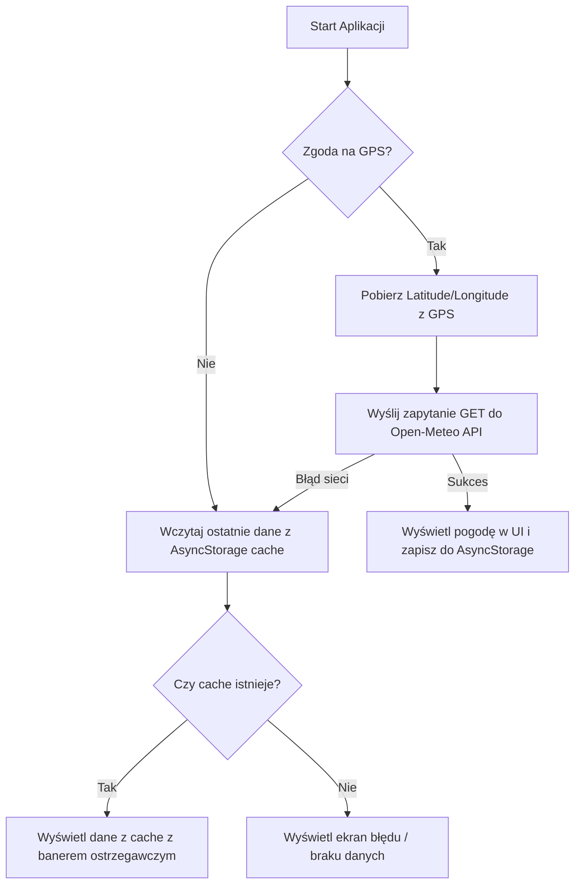

# Dokumentacja techniczna — Lab 4 (Zasoby sprzętowe i publiczne API)

## 1. Opis celu aplikacji
Aplikacja mobilna **„Pogoda Tu i Teraz”** ma na celu pobieranie współrzędnych geograficznych urządzenia za pomocą modułu GPS, a następnie odczyt i prezentację bieżących informacji pogodowych oraz prognozy godzinowej (24-godzinnej) dla danej lokalizacji użytkownika. 

Aplikacja wspiera pełną obsługę stanów ładowania, sukcesu, błędów połączenia sieciowego, braku usług GPS oraz odmowy uprawnień przez użytkownika, a także przechowuje dane w lokalnej pamięci podręcznej (tryb offline / cache).

---

## 2. Wykorzystane dane z urządzenia
- **Współrzędne geograficzne (Latitude & Longitude)**: Pobierane za pośrednictwem modułu GPS/sieciowego urządzenia mobilnego z wykorzystaniem pakietu `expo-location`.

---

## 3. Wykorzystane biblioteki i API
- **SDK Expo**:
  - `expo-location`: do obsługi zapytań o uprawnienia do lokalizacji w tle oraz odczytu współrzędnych GPS.
- **Pamięć lokalna**:
  - `@react-native-async-storage/async-storage`: do lokalnego cache'owania ostatniej poprawnej odpowiedzi pogodowej.
- **Zewnętrzne API**:
  - **Open-Meteo API** (`https://open-meteo.com/`): Darmowe, publiczne API pogodowe niewymagające klucza deweloperskiego. Wykorzystano endpoint prognozy:
    `https://api.open-meteo.com/v1/forecast` przekazując parametry `latitude`, `longitude` oraz żądając zmiennych dla stanu bieżącego (`current`) i godzinowego (`hourly`).

---

## 4. Przepływ danych w aplikacji


1. **Uruchomienie**: Aplikacja sprawdza uprawnienia lokalizacyjne.
2. **GPS**: Pobierana jest aktualna lokalizacja urządzenia (`getCurrentPositionAsync`).
3. **Pobieranie z API**: Wysyłany jest request HTTP GET do Open-Meteo.
4. **Renderowanie**:
   - Wyświetlenie aktualnych warunków (temperatura, wilgotność, wiatr, opady) z mapowaniem kodów WMO na czytelny opis i emoji.
   - Wykres/lista godzinowa (kolejne 24h) z prawdopodobieństwem opadów.
5. **Obsługa gestów**: Przeciągnięcie w dół (Pull to Refresh) wyzwala ponowną procedurę pobierania lokalizacji i odświeżenia danych.

---

## 5. Ograniczenia i napotkane problemy
- **Brak połączenia sieciowego**: W przypadku braku sieci pobranie danych z API kończy się błędem. Rozwiązaniem było zaimplementowanie cache na bazie `AsyncStorage`, który pozwala na działanie w trybie offline.
- **Czas pobierania lokalizacji**: Pobranie dokładnej pozycji GPS przy zimnym starcie na urządzeniu może zająć od kilku sekund wzwyż. Aby zminimalizować czas oczekiwania, zastosowano parametr zrównoważonej dokładności `Accuracy.Balanced`.
- **Brak zgody na lokalizację**: Jeśli użytkownik odmówi dostępu do GPS, aplikacja uniemożliwi pobranie aktualnych danych. Dodano obsługę tego stanu z widokiem informacyjnym i przyciskiem ponownego wywołania zapytania o uprawnienia.
- **Zasoby emulatora**: Na emulatorach komputerowych lokalizacja może być zwracana jako statyczny punkt (np. Googleplex). Do pełnych testów zaleca się użycie urządzenia fizycznego z włączonym GPS.

---

## 6. Instrukcja uruchomienia (w katalogu `lab4/project`)
1. Zainstaluj zależności:
   ```bash
   npm install
   ```
2. Uruchom serwer developerski:
   ```bash
   npm start
   ```
3. Otwórz w aplikacji Expo Go na telefonie fizycznym lub emulatorze.
